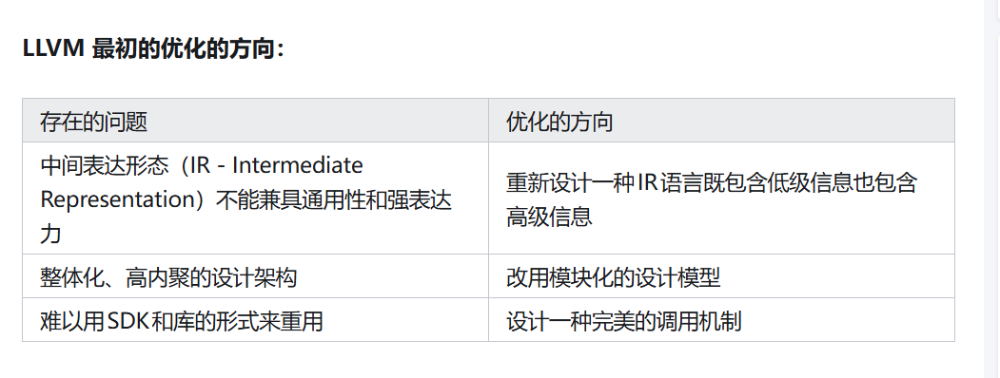
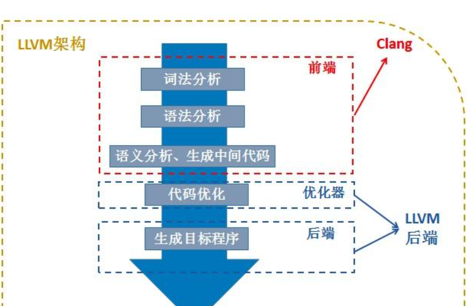

# 1 概念
## 1.1三段式架构
* Frontend（前端）：主要工作是解析源代码：词法分析、语法分析、语义分析、检查错误，并构建抽象语法树（Abstract Syntax Tree AST）来表示输入代码。AST 可以选择性地转换为中间表达式，以便用于优化器。
* Optimizer（优化器）：负责优化代码，使代码更高效。例如消除冗余
* Backend（后端）：负责将优化器优化后的中间代码转化为目标机器指令集，最大化利用目标机器的特殊指令，提高代码的性能。例如：指令选择、寄存器分配和指令调度
## 1.2 优化方向
  
### 1.2.1 LLVM 架构优点：
* 不同的前端后端使用统一的中间代码 LLVM Intermediate Representation（LLVM IR）
1.新增支持一种新的编程语言（前端语言），只需实现一个新的前端
2.新增支持一种新的硬件设备（架构体系），只需要实现一个新的后端
3.优化阶段是一个通用的阶段，针对的是不同的前端生成统一的中间代码
* 在某些平台中编译要比GCC快得多，例如，调试模式下编译Objective-C时，LLVM比GCC快3倍。
* 在生成抽象语法树（AST - Abstract Syntax Tree）时，占用的内存仅为GCC的1/5。
1.LLVM调试的调试信息表达更精准、更容易易分析和阅读。
2.LLVM被设计成一个模块化库，更容易嵌入IDE或进行重用。
3.LLVM很灵活，并且比GCC更容易扩展。
## 1.3 前端：
### 1.3.1 Clang
什么是 Clang？
* Clang 是指 LLVM 项目的编译器的前端部分，支持对 C 家族语言(C、C++、Objective-C)的编译。
* Clang的功能包括：词法分析、语法分析、语义分析、生成中间中间代码 LLVM Intermediate Representation (LLVM IR)。
### 1.3.2 IR
LLVM 设计的最重要方面是 LLVM 中间代码（IR），它是用来在编译器中表示源码的一种形式。
```c
unsigned add(unsigned a, unsigned b) {
  return a + b;
}
```

define i32 @add(i32 %a, i32 %b) {
entry:
  %tmp1 = add i32 %a, %b
  ret i32 %tmp1
}

## 1.4 后端
架构如下：
  
# 2 如何工作
## 2.1 编译前端
编译前端：预处理、词法分析、语法分析、语义分析，编译成中间代码
### 2.1.1 预处理
预处理器：负责条件编译、源文件包含、宏替换、行控制、抛错、杂注和空指令;
### 2.1.2 词法分析 (Lexer)
词法分析：将预处理过的代码转化成一个个Token，比如左括号、右括号、等于、字符串等等。
### 2.1.3 语法分析(Syntax) AST
语法分析：根据当前语言的语法，验证语法是否正确，并将所有节点组合成抽象语法树(AST)。
### 2.1.4 生成中间代码(IR)
CodeGen 负责将语法树从顶至下遍历，翻译成中间代码IR，IR是LLVM Frontend的输出，也是LLVM Backerend的输入，桥接前后端。
## 2.2 优化器
优化器：负责中间代码优化
### 2.2.1 代码优化(Opt)
例如 Xcode 中开启了bitcode，那么苹果后台拿到的就是这种中间代码，苹果可以对 bitcode 做进一步的优化。
## 2.3 编译后端
编译后端：负责中间代码优化、生成目标文件
### 2.3.1 汇编 代码生成器（assembler）
### 2.3.2 链接成可执行文件（linker）