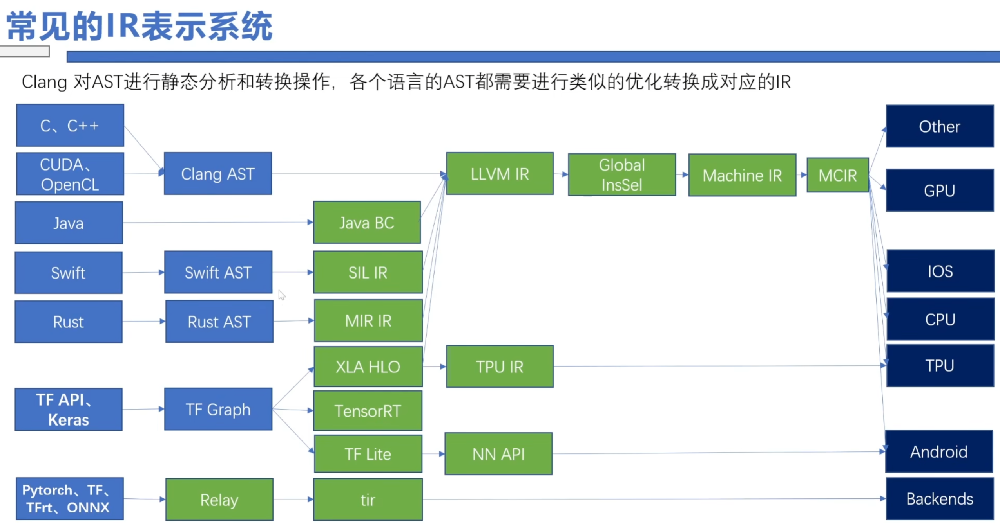

# 第 2 章：生成基础 MLIR
  

MLIR 被设计为一套完全可扩展的基础架构：不存在封闭固定的属性（可理解为常量元数据）、操作或类型集合。MLIR 通过方言（Dialect） 这一概念实现可扩展性，方言会在唯一命名空间下对抽象逻辑进行分组管理。
在 MLIR 中，操作（Operation） 是抽象与计算的核心单元，在很多方面与 LLVM 指令类似。操作可以承载应用专属语义，能够表示 LLVM 中所有核心 IR 结构：指令、全局对象（如函数）、模块等。
## 1.1 定义 Toy 方言
为高效对接 MLIR，我们将定义全新的 Toy 方言。该方言会建模 Toy 语言的结构，同时为高层分析与转换提供便捷途径。
```c++
/// Toy方言定义：方言继承自mlir::Dialect，可注册自定义属性、操作、类型，
/// 也可重写虚方法修改通用行为，教程后续章节会演示这一点。
class ToyDialect : public mlir::Dialect {
public:
  explicit ToyDialect(mlir::MLIRContext *ctx);

  /// 方言命名空间工具访问器
  static llvm::StringRef getDialectNamespace() { return "toy"; }

  /// 方言构造函数调用的初始化方法，用于注册方言内的属性、操作、类型等
  void initialize();
};
```
以上是 C++ 形式的方言定义，MLIR 也支持通过 TableGen 以声明式定义方言。声明式定义可大幅减少样板代码，还能直接伴随方言生成文档。Toy 方言的声明式定义如下：
```tablegen
// 在ODS框架中定义toy方言，用于后续定义操作
def Toy_Dialect : Dialect {
  // 方言命名空间，与ToyDialect::getDialectNamespace字符串一一对应
  let name = "toy";

  // 方言单行简述
  let summary = "用于分析和优化Toy语言的高层方言";

  // 方言详细描述
  let description = [{
    Toy语言是基于张量的编程语言，支持定义函数、数学计算与结果打印。
    该方言提供了便于分析与优化的语言表示形式。
  }];

  // 方言类定义所在的C++命名空间
  let cppNamespace = "toy";
}
```
可通过mlir-tblgen工具执行gen-dialect-decls动作查看生成代码：
```sh
${build_root}/bin/mlir-tblgen -gen-dialect-decls ${mlir_src_root}/examples/toy/Ch2/include/toy/Ops.td -I ${mlir_src_root}/include/
```
方言定义完成后，可加载至MLIRContext：
```cpp
context.loadDialect<ToyDialect>();
```
默认情况下，MLIRContext仅加载内置方言（提供核心 IR 组件），因此 Toy 等自定义方言必须显式加载。
## 1.2 定义 Toy 操作
定义 Toy 方言后，即可开始定义操作，为系统其他模块提供语义信息。以toy.constant操作为例，该操作表示 Toy 语言中的常量值：
```mlir
%4 = "toy.constant"() {value = dense<1.0> : tensor<2x3xf64>} : () -> tensor<2x3xf64>
```
该操作无输入操作数，通过名为value的稠密元素属性表示常量，返回一个秩确定的张量类型结果。操作类继承自 CRTP 模式的mlir::Op类，可通过可选特征自定义行为，特征用于注入额外能力（如访问器、验证逻辑等）。constant操作的 C++ 定义如下：
```cpp
class ConstantOp : public mlir::Op<
                     /// mlir::Op为CRTP类，需将派生类作为模板参数传入
                     ConstantOp,
                     /// 常量操作无输入操作数
                     mlir::OpTrait::ZeroOperands,
                     /// 常量操作返回单个结果
                     mlir::OpTrait::OneResult,
                     /// 提供getType工具方法，返回单个结果的张量类型
                     mlir::OpTrait::OneTypedResult<TensorType>::Impl> {

 public:
  /// 继承基类Op的构造函数
  using Op::Op;

  /// 操作唯一名称，MLIR据此注册并全局唯一标识操作，
  /// 名称必须以父方言命名空间+`.`为前缀
  static llvm::StringRef getOperationName() { return "toy.constant"; }

  /// 从属性中获取常量值
  mlir::DenseElementsAttr getValue();

  /// 可在特征之外补充额外验证逻辑，
  /// 此处校验常量操作的不变量：结果类型为张量类型，且与value属性类型匹配
  LogicalResult verifyInvariants();

  /// 提供从输入值构建操作的接口，供builder类快速生成操作实例：
  /// mlir::OpBuilder::create<ConstantOp>(...)
  /// 该方法填充MLIR创建操作所需的state，包含操作的所有离散组件
  static void build(mlir::OpBuilder &builder, mlir::OperationState &state,
                    mlir::Type result, mlir::DenseElementsAttr value);
  /// 复用value的类型构建常量
  static void build(mlir::OpBuilder &builder, mlir::OperationState &state,
                    mlir::DenseElementsAttr value);
  /// 广播传入值构建常量
  static void build(mlir::OpBuilder &builder, mlir::OperationState &state,
                    double value);
};
```
在 Toy 方言初始化方法中注册该操作：
```cpp
void ToyDialect::initialize() {
  addOperations<ConstantOp>();
}
```
定义操作后，即可对其进行访问与转换。MLIR 中有两个核心操作相关类：Operation与Op。
* Operation：通用建模所有操作，属于 “不透明” 类型，不描述特定操作的属性，仅提供操作实例的通用 API。
* Op：每个具体操作类型对应一个派生类，如ConstantOp表示无输入、单输出的固定值操作，是包裹Operation*的智能指针，提供专属访问器与类型安全属性。
### 1.2.2 使用操作定义规范（ODS）框架
除特化mlir::Op C++ 模板外，MLIR 还支持通过操作定义规范（ODS） 框架声明式定义操作。通过 TableGen 记录操作的核心信息，编译时会自动展开为等价的mlir::Op C++ 模板特化代码。得益于简洁性、易用性与对 C++ API 变更的稳定性，ODS 是 MLIR 中定义操作的推荐方式。
以下是ConstantOp的 ODS 等价定义：
#### 1.2.2.1首先为 Toy 方言操作定义基类，简化后续操作定义：
```tablegen
// Toy方言操作基类，继承自OpBase.td中的基础Op类，提供：
// 1. 操作所属父方言
// 2. 操作助记符（不含方言前缀的名称）
// 3. 操作特征列表
class Toy_Op<string mnemonic, list<Trait> traits = []> :
    Op<Toy_Dialect, mnemonic, traits>;
```
#### 1.2.2.2基于基类定义常量操作：
```tablegen
def ConstantOp : Toy_Op<"constant"> {
}
```
可通过mlir-tblgen执行gen-op-decls或gen-op-defs查看生成的 C++ 代码：
```sh
${build_root}/bin/mlir-tblgen -gen-op-defs ${mlir_src_root}/examples/toy/Ch2/include/toy/Ops.td -I ${mlir_src_root}/include/
```
#### 1.2.2.3 定义参数与结果
操作的参数（输入）可为属性或 SSA 操作数类型，结果对应操作生成值的类型集合：
```tablegen
def ConstantOp : Toy_Op<"constant"> {
  // 常量操作仅接收一个属性作为输入，F64ElementsAttr为64位浮点元素属性
  let arguments = (ins F64ElementsAttr:$value);

  // 常量操作返回单个张量类型结果，F64Tensor为64位浮点张量类型
  let results = (outs F64Tensor);
}
```
为参数 / 结果命名（如$value）后，ODS 会自动生成对应访问器：DenseElementsAttr ConstantOp::value()。
#### 1.2.2.4 添加文档
操作可通过summary和description字段添加语义文档，供方言使用者参考，甚至可自动生成 Markdown 文档：
```tablegen
def ConstantOp : Toy_Op<"constant"> {
  let summary = "常量操作";
  let description = [{
    常量操作将字面量转为SSA值，数据以属性形式附加到操作，示例：
      %0 = "toy.constant"()
         { value = dense<[[1.0, 2.0, 3.0], [4.0, 5.0, 6.0]]> : tensor<2x3xf64> }
        : () -> tensor<2x3xf64>
  }];

  let arguments = (ins F64ElementsAttr:$value);
  let results = (outs F64Tensor);
}
```
#### 1.2.2.5附加构建方法
ODS 会自动生成基础构建方法，复杂构建方法可通过builders字段定义
```tablegen
def ConstantOp : Toy_Op<"constant"> {
  ...
  // 自定义构建方法，用于ConstantOp::create
  let builders = [
    // 基于给定张量常量值构建常量
    OpBuilder<(ins "DenseElementsAttr":$value), [{
      build(builder, result, value.getType(), value);
    }]>,
    // 基于给定浮点值构建常量
    OpBuilder<(ins "double":$value)>
  ];
}
```
#### 1.2.2.6 声明式自定义汇编格式
此时生成的 Toy IR 均采用通用汇编格式，可读性较差。MLIR 允许操作通过声明式或 C++ 命令式方式自定义汇编格式，精简冗余语法。以toy.print为例：
通用格式：
```mlir
"toy.print"(%5) : (tensor<*xf64>) -> ()
```
自定义精简格式：
```mlir
toy.print %5 : tensor<*xf64>
```
#### 1.2.2.7 声明式定义格式
```tablegen
def PrintOp : Toy_Op<"print"> {
  let arguments = (ins F64Tensor:$input);
  // 声明式汇编格式：操作数 + 属性字典 + 类型标注
  let assemblyFormat = "$input attr-dict `:` type($input)";
}
```
C++ 命令式实现（可选）
// 打印方法
void PrintOp::print(mlir::OpAsmPrinter &printer) {
  printer << "toy.print " << op.input();
  printer.printOptionalAttrDict(op.getAttrs());
  printer << " : " << op.input().getType();
}

// 解析方法
```cpp
mlir::ParseResult PrintOp::parse(mlir::OpAsmParser &parser,
                                 mlir::OperationState &result) {
  mlir::OpAsmParser::UnresolvedOperand inputOperand;
  mlir::Type inputType;
  if (parser.parseOperand(inputOperand) ||
      parser.parseOptionalAttrDict(result.attributes) || parser.parseColon() ||
      parser.parseType(inputType))
    return mlir::failure();
  if (parser.resolveOperand(inputOperand, inputType, result.operands))
    return mlir::failure();
  return mlir::success();
}
```
